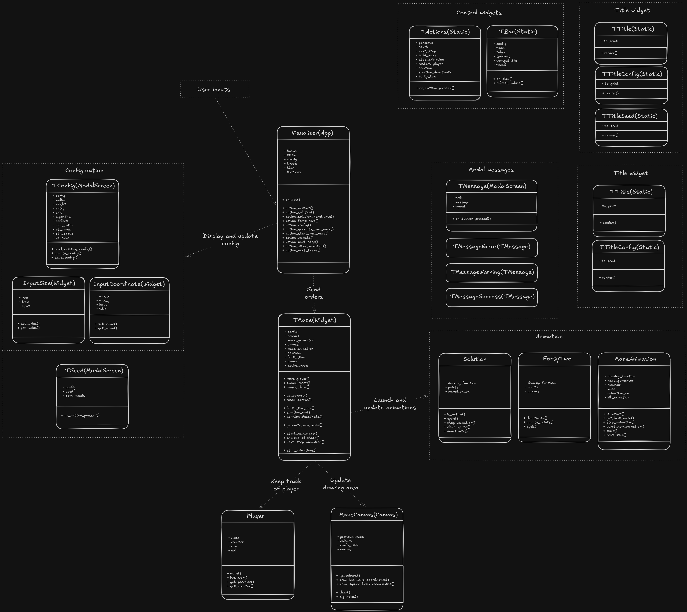

*This project has been created as part of the 42 curriculum by flinguen, rapoggi*

# A-Maze-ing


<video controls align="center">
  <source src="https://github.com/user-attachments/assets/cb77c8f4-f1c4-4ecf-b514-84c20d8fc1d6" type="video/mp4">
</video>

<!--  -->
## Description

This repository is our version of the A-Maze-ing project from 42's curriculum.  
It is written in Python and aims for a better understanding of Python and OOP 
by the generation and display of a perfect (or not) maze.
A perfect maze is one in which any point A and B are connected by a unique path.
  
This implies choosing between several algorithms and display libraries, choices 
which will be discussed later on.  

## Instructions

This project uses uv for automatic virtual environment management.  
  
A Makefile has been provided. Run:  

```Bash
    make install
```
> to install dependencies needed by the project.
  
To execute run:  
```Bash
    make run
```
> this will fetch the config.txt file in the repository and pass it to the script  
   
```Bash
    make clean
```
> removes cached folders and files, as well as venv and info created by uv  
 
```Bash
    make lint
```
> runs flake8 and mypy on current directory  

Command to fix the pytest import failure:  

```Bash
    uv pip install -e .
```

## Visualiser

### Controls
+ S      - Start from a blank grid (new maze)  
+ A      - Play generation animation
+ N      - Display the algorithm's next step    
+ G      - Generate a new maze skipping animatation  
+ F      - Animate 42 logo
+ R      - Reset player position
+ W      - Play solution animation
+ U      - Hide solution
+ Q      - Stop animation
+ C      - Enter config menu
+ CTRL+P - Options
+ CTRL+Q - Exit program


### Schematics
<div align="center">
    
</div>


## Resources

<https://en.wikipedia.org/wiki/Maze_generation_algorithm>  
For reference about the Wilson and DFS algorithms for maze generation  
<https://geeks4geeks.org>  
To answer various Python questions  
<https://textual.textualize.io/guide>  
<https://textual-canvas.davep.dev/>  
For reference about textual - graphical library  
 
AI was used throuhought the project as a help for understanding 
complex previously unseen python concepts.  
 
This repository contains no AI generated code/content.  

## Config File

The config.txt file needs simple but strict encoding of values: KEY=value  
Lines that start with '#' are considered comments and ignored.
All keys and example values in an example config.txt:  

    # THIS IS A COMMENT
    WIDTH=20
    HEIGHT=20
    ENTRY=0,0
    EXIT=19,19
    PERFECT=False
    LOOP_RATIO=75
    ALGO=Wilson
    SEED=42
    PRINT_TO_FILE=True

Note this default config.txt is already present in the repository.  
Configuration can also be modified either in memory or in file  
through the visualiser's config menu.  

## Algorithm

We have implemented both the Wilson and DFS algorithms for maze generation.  
 
The Wilson algorithm starts by picking a random start cell and a random end cell.  
It walks, with each step being random, from start to end, and on finish marks  
traversed cells as in-maze.  
Then it chooses randomly a not-in-maze cell, and walks again until it reaches an in-maze cell.  
And it repeats the last step until no cell is left out of maze.  
  
It never ends up blocking and looping infinitely thanks to LERW. Loop Erased Random Walk.  
Essentially, at each random step, if position after step is in the path we have already walked,  
revert the path all the way back to that cell and go back from here.  
  
The principal argument towards the choice of this algorithm is it's unbiased character.  
In opposite to most other algorithms, this one generates a uniform spanning tree.  
From what I understand of graph theory, this implies that any possible maze within a given size  
has an equal chance of being the algorithm's result as any other.  
  
The DFS algorithm starts from a random cell, marks it as visited, and then goes from neighbours  
to neighbours, at the condition neighbour is unvisited. When it reaches a cell with no unvisited  
neighbours, it backtracks to the last cell that has any unvisited neighbours and keeps going.  
  
This one, although it is biased towards long corridors, usually creates more visually  
pleasing mazes compared to the Wilson. It's simplicity of concept and code is also a  
strong argument.  

BFS was used for pathfinding, with a principle similar to DFS.
 
## Code reusability

> As required by the subject, this repository contains a mazegen-0.1.0-any.tar.gz package,  
> installable via any python module installer, which contains the generation part  
> of our project. Here is the documentation findable inside the package  
 

-------------------------------------------------------------------------------

<div align="center">
    
</div>

## Instantiation

The MazeGenerator class constructor can take either a Dict or a Config object as argument,  
in which it will seek parameters and elements needed for the maze generation.  
For more information, see [Config](#config).  
 
For default configuration :  

```Python
    from mazegen import MazeGenerator
    
    generator = MazeGenerator()
```


With customization via Dict (shown parameters are mandatory):

```Python
    from mazegen import MazeGenerator

    generator = MazeGenerator(config_dict={"HEIGHT": 20,
                                           "WIDTH": 20,
                                           "ENTRY": (0, 0),
                                           "EXIT": (19, 19),
                                           "OUTPUT_FILE": "maze.txt",
                                           "PERFECT": True,
                                           }
                             )
```

 
With customized Config object:  

```Python
    from mazegen import MazeGenerator, Config

    config = Config.model_validate({"WIDTH": 40,
                                    "HEIGHT": 20,
                                    "ENTRY": (0, 0),
                                    "EXIT": (19, 19),
                                    "OUTPUT_FILE": "maze.txt",
                                    "PERFECT": True})

    generator = MazeGenerator(config=config)
```


## Usage

To get direct access to the generated maze, it's parameters and it's solution :  

```Python
    from mazegen import MazeGenerator
    
    generator = MazeGenerator()
    maze = generator.get_maze()
    print(maze)
    print(maze.solution)
    print(maze.seed)
```

This returns a Maze object, which holds all the parameters relevant to its generation.  
It also includes a break\_wall() method, which takes two tuples of coordinates and  
breaks the wall between the two represented cells.  

```Python
    from mazegen import MazeGenerator
    
    generator = MazeGenerator()
    maze = generator.get_maze()

    # safe is a bool that prevents the creation of cells like 0b0000
    maze.break_wall((0, 0), (0, 1), safe=True)
```

 
> Reminder: cells are hexadecimal values from 0x0 to 0xF whose bytes,  
>  from least to most significant, represent North, East, South and West walls.  

get\_maze() skips to the very last element yielded by a generator (generate())  
and returns it. If you wish to animate the generation or only use generated data  
up to a certain point, you may also use generate():  

```Python
    from mazegen import MazeGenerator

    generator = MazeGenerator()
    for maze in generator.generate():
        print(maze)
```

The actual maze (two-dimensional array of hexadecimal values)  
    is stored in maze.values  

Maze's \_\_str\_\_() returns the maze in hexadecimal values, entry and exit  
coordinates, and instructions to 'walk' from one to the other.  
If an OUTPUT\_FILE has been given on config, it is written to  
said file on generate's last yield  

## Config

To customize the generated maze, we could set config\_dict={"KEY\_ALIAS":value}.  
If we wanted further control, we would use a Config object passed to MazeGenerator 
on initialization. The Config class inherits from pydantic's BaseModel and runs various  
data sanity checks to ensure coherent data is going to end up in the maze.  
  
Amongst all possible parameters, the following are mandatory:

| Attribute name | Alias |
|----------------|-------|
| nb\_col | HEIGHT |
| nb\_row | WIDTH |
| entry | ENTRY |
| exit | EXIT |
| output\_file | OUTPUT\_FILE |
| perfect | PERFECT |

Config().model\_validate() can be given a dictionnary whose keys define which  
parameter is set and it's values... the value.  
It can also be modified after initialisation through it's setter, here an example of both:  

```Python
    from mazegen import MazeGenerator, Config

    # Instantiate generator with custom dictionnary
    temp_generator = MazeGenerator(config_dict={"WIDTH": 20,
                                                "HEIGHT": 20,
                                                "ENTRY": (0, 0),
                                                "EXIT": (19, 19),
                                                "OUTPUT_FILE": "maze.txt",
                                                "PERFECT": True})
    del temp_generator

    # Initalises config with custom dict (by alias)
    config = Config.model_validate({"WIDTH": 40,
                                    "HEIGHT": 20,
                                    "ENTRY": (0, 0),
                                    "EXIT": (19, 19),
                                    "OUTPUT_FILE": "maze.txt",
                                    "PERFECT": True})

    # Sets new values after initialisation (by attr name)
    config.set("perfect", False)
    config.set("loop_ratio", 75)

    generator = MazeGenerator(config=config)
    maze = generator.get_maze()
    print(maze)
```

Data always gets routed through checks before assignation.  
Here are all parameters and their default values:  

| Parameter | Alias   | Default |
| --------- | ------- | ------- |
| nb\_col   | WIDTH   | None    |
| nb\_row   | HEIGHT  | None    |
| entry     | ENTRY   | None  |
| exit      | EXIT    | None |
| output\_file | OUTPUT\_FILE | None|
| perfect   | PERFECT | None |
| seed      | SEED    | date+"AUTO"+time |
| algo      | ALGO    | Wilson  |
| loop\_ratio | LOOP\_RATIO | 100 |
| print\_to\_file | PRINT\_TO\_FILE | True |

These are all available through the Config object for both getting  
and setting. Note all parameters except file and algo related are also  
available through the generated maze from instantiation on.  

-------------------------------------------------------------------------------

## Team Project Management

To approach this project, we chose simply to split the workload in half. 
One takes care of the generation process, the other the visualisation process. 
This division seems to have worked quite well as we remained constantly productive 
throuhought the project.  
Passing/receiving data from and through each-others python modules thaught us 
adaptability, although of course we took the time to give a deep look and understand 
each other's code. 

## Bonuses

As for additionnal functionnalities to be considered bonuses that we have implemented: 
+ Real-time maze generation animation
+ Playable maze (arrow keys to find your way out) 
+ Several generation algorithms
+ Logo animation
+ Path finding animation
+ Modifiable config inside app
