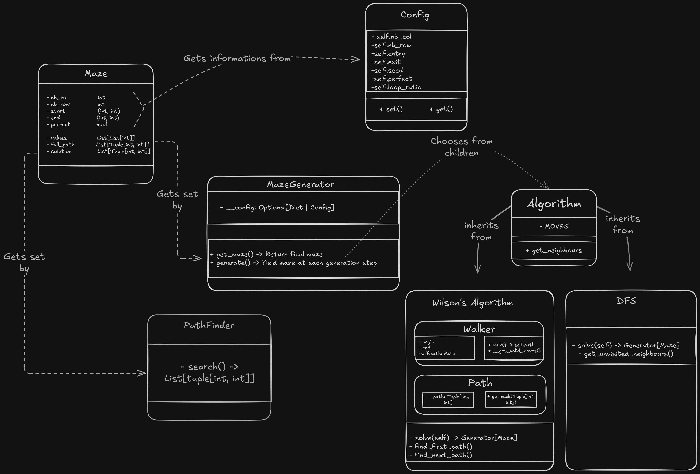

# mazegen - MazeGenerator class

-------------------------------

    

## Instantiation

The MazeGenerator class constructor can take either a Dict or a Config object as argument,  
in which it will seek parameters and elements needed for the maze generation.  
For more information, see [Config](#config).  
 
For default configuration :  

    from mazegen import MazeGenerator
    
    generator = MazeGenerator()

With customization via Dict:

    from mazegen import MazeGenerator

    generator = MazeGenerator(config_dict={"HEIGHT": 20, "WIDTH": 20})

 
With customized Config object:  

    from mazegen import MazeGenerator, Config

    config = Config(height=20, width=20, seed="42", algo="Wilson")

    generator = MazeGenerator(config=config)

## Usage

To get direct access to the generated maze, it's parameters and it's solution :  

    from mazegen import MazeGenerator
    
    generator = MazeGenerator()
    maze = generator.get_maze()
    print(maze)
    print(maze.solution)
    print(maze.seed)

This returns a Maze object, which holds all the parameters relevant to its generation.  
It also includes a break\_wall() method, which takes two tuples of coordinates and  
breaks the wall between the two represented cells.  

    from mazegen import MazeGenerator
    
    generator = MazeGenerator()
    maze = generator.get_maze()

    # safe is a bool that prevents the creation of cells like 0b0000
    maze.break_wall((0, 0), (0, 1), safe=True)

 
> Reminder: cells are hexadecimal values from 0x0 to 0xF whose bytes,  
>  from least to most significant, represent North, East, South and West walls.  

get\_maze() skips to the very last element yielded by a generator (generate())  
and returns it. If you wish to animate the generation or only use generated data  
up to a certain point, you may also use generate():  

    from mazegen import MazeGenerator

    generator = MazeGenerator()
    for maze in generator.generate():
        print(maze)

The actual maze (two-dimensional array of hexadecimal values)  
    is stored in maze.values  

Maze's \_\_str\_\_() returns the maze in hexadecimal values, entry and exit  
coordinates, and instructions to 'walk' from one to the other.  
If an OUTPUT\_FILE has been given on config, it is written to  
said file on generate's last yield  

## Config

To customize the generated maze, we could set config\_dict={"KEY\_ALIAS":value}.  
If we wanted further control, we would use a Config object passed to MazeGenerator 
on initialization. The Config class inherits from pydantic's BaseModel and runs various  
data sanity checks to ensure coherent data is going to end up in the maze.  
  
Config().model\_validate() can be given a dictionnary whose keys define which  
parameter is set and it's values... the value.  
It can also be modified after initialisation through it's setter, here an example of both:  

    from mazegen import MazeGenerator, Config

    # Instantiate generator with custom dictionnary
    temp_generator = MazeGenerator(config_dict={"WIDTH": 20,
                                                "HEIGHT": 20,
                                                "SEED": 420})
    del temp_generator

    # Initialises config with default values
    temp_config = Config()
    del temp_config

    # Initialises config with custom parameters (by attribute name)
    temp_config1 = Config(width=40, height=40, entry=(0, 0), exit=(39, 39))
    del temp_config1

    # Initalises config with custom dict (by alias)
    config = Config.model_validate({"WIDTH": 40,
                                    "HEIGHT": 20,
                                    "SEED": 42,
                                    "ALGO": DFS})

    # Sets new values after initialisation (by attr name)
    config.set("perfect", False)
    config.set("loop_ratio", 75)

    generator = MazeGenerator(config=config)
    maze = generator.get_maze()
    print(maze)

Data always gets routed through checks before assignation.  
Here are all parameters and their default values:  

| Parameter | Alias   | Default |
| --------- | ------- | ------- |
| nb\_col   | WIDTH   | 15      |
| nb\_row   | HEIGHT  | 15      |
| entry     | ENTRY   | (0, 0)  |
| exit      | EXIT    | (14, 14)|
| output\_file | OUTPUT\_FILE | maze.txt |
| perfect   | PERFECT | False   |
| seed      | SEED    | date+"AUTO"+time |
| algo      | ALGO    | Wilson  |
| loop\_ratio | LOOP\_RATIO | 100 |

These are all available through the Config object for both getting  
and setting, except getting the seed: if none is set in file, the generator  
creates one like f"{datetime.now()}AUTO{time.time()}" and stores it  
directly inside the maze. Note all parameters except output\_file are also  
available through the generated maze from instantiation on.  

## Additional 

Calling MazeGenerator's generate(), then modifying the config,  
then calling generate() again will result in a new, updated maze of  
parameters specified in newly modified Config.  
  
If you wish to implement your own algorithm, look at the Algorithm class.  
All you have to do is implement a children of Algorithm and implement the "solve" method  
which takes a Maze object and sets its values accordingly.  
Then writing ALGO=YourAlgoClassName will end up in your algorithm being used for generation.  
